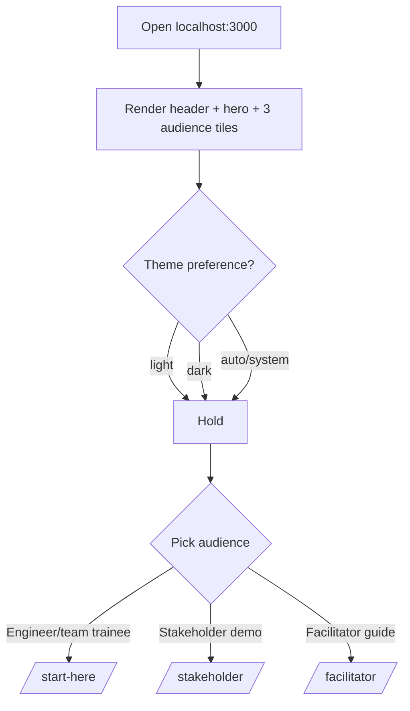
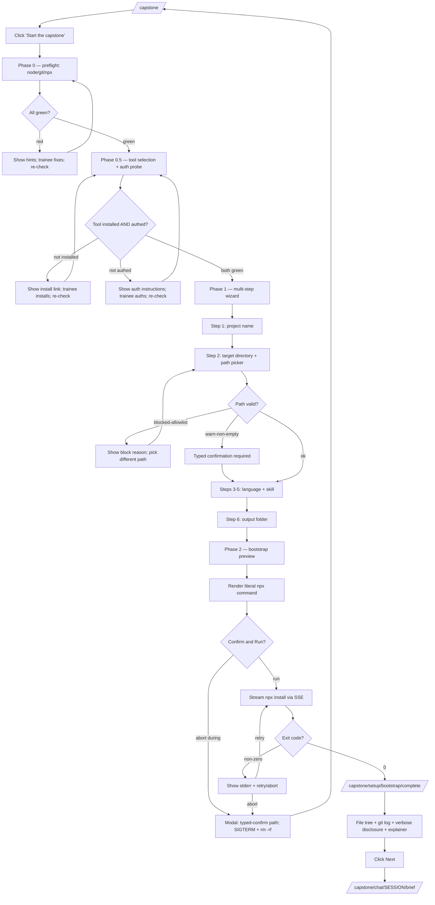
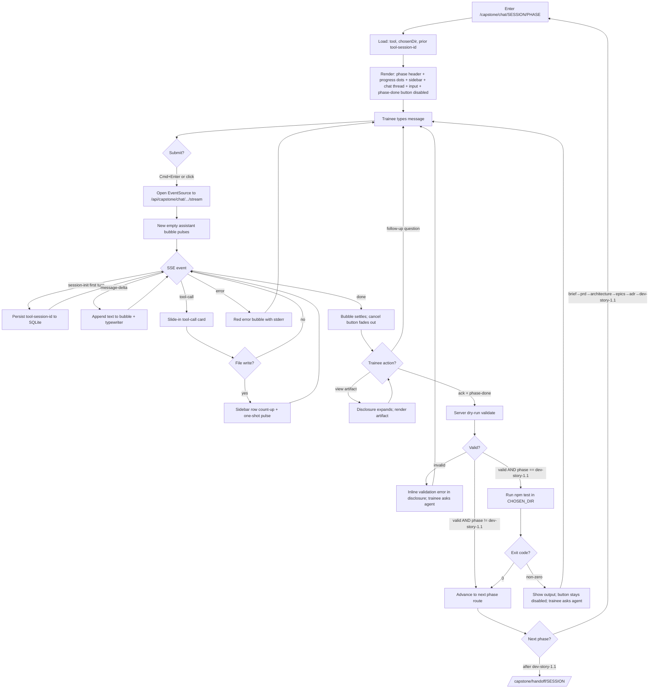
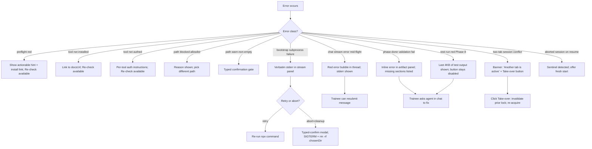

# UX Design Specification — bmad_demo

**Author:** Devbox
**Date:** 2026-05-08

**Scope:** Epic 11 — UI Polish + Theming. Lands BEFORE Epic 5-10 (capstone rebuild) implementation work so design tokens, theme provider, and header layout are in place before the rebuilt capstone's ~10 new pages are authored.

**Locked context:**
- Stack: Next.js 16 App Router + Tailwind CSS + Radix primitives + vendored fonts (NFR-S1: zero remote assets).
- Accessibility: WCAG 2.x Level AA (NFR-A1) — release gate.
- Theme: Light + Dark + Auto, persists in localStorage.
- Logo: ships at `public/brand/` (Cargill wordmark provided by user 2026-05-08; vendored locally per NFR-S1).
- Brand palette: neutral baseline (slate/zinc family) with one tunable accent token. Adopting forks swap the accent.

<!-- UX design content appended sequentially through collaborative workflow steps -->

## Executive Summary

### Project Vision

bmad_demo is Cargill's internal BMAD training portal — a self-referential Next.js + SQLite app that teaches engineering teams how to adopt BMAD as a team and govern AI-assisted contributions via GitHub-native machinery (CODEOWNERS, branch protection, lead-approval merge gates). The portal *is* the lesson: trainees fork it, tailor CODEOWNERS for their own context, and that fork becomes the next team's reference.

The UX must do double duty: (1) be a comfortable training interface for trainees with mixed AI-tool backgrounds and mixed coding skill levels; (2) be an exemplar of "this is what professional internal tooling can look like" — since trainees evaluate the portal silently as they use it, asking "would I take this back to my team?" Polish and theming are part of the pedagogy, not decoration.

### Target Users

- **Engineer-Trainee (Mira persona)** — senior backend engineer using Claude Code; expects dense layouts, power-user keyboard affordances, dark-mode-by-default. 90-120 min focused capstone session, often evening/weekend. Laptop ≥1024px viewport.
- **Non-Engineer Trainee (Priya persona)** — product manager or designer; less code-savvy but participating in the same curriculum. UI must read as approachable — same content density, but with more visible reassurance affordances and no implicit assumption of CLI fluency.
- **Stakeholder (Marcus persona)** — VP-level exec running the 15-minute scripted demo. Everything must be legible at first glance, no learning curve, no time to discover affordances.
- **Facilitator (Lena persona)** — engineering lead running a half-day workshop. Will *project* the portal in a conference room. Contrast under projector lighting and large-screen typography matter.

### Key Design Challenges

1. **One UI, four mental models.** Visual hierarchy must serve power user + cautious non-engineer + executive visitor + projector presenter without any single audience dominating.
2. **Self-reference raises the polish bar.** The portal is silently being evaluated as a forkable artifact. Standard internal-tool aesthetic does not clear the "I'd bring this to my team Monday" bar.
3. **Capstone surface density.** The rebuilt capstone (~10 new pages: setup wizard, multi-step path picker, bootstrap progress, six chat phases, handoff) packs streaming chat, tool-call cards, primer panels, file trees, validation states. Token + pattern system must compose across this density.
4. **Flicker-free theme switching.** First paint cannot show light before flipping to dark; SSR + inline-head theme-resolution script is non-negotiable.
5. **Three-color audience-tile critique.** Current home page uses one color per audience tile. Unified treatment is required; differentiation must come from iconography, typography, and layout rather than hue.
6. **Cargill brand restraint.** Cargill logo (with green leaf) ships in the header, but the portal palette stays neutral with one *tunable* accent — adopting forks pick their own. The portal must not read as a Cargill product page.

### Design Opportunities

1. **Information density done well = professional credibility.** Linear/Vercel/Stripe-flavored typography scale, restrained palette, generous whitespace, soft-but-present elevation. The portal can feel like a craft tool without bloat.
2. **Chat surface as a craft tool, not a chatbot.** Typed tool-call cards (▶ reading brief.md...), collapsible primer disclosures, inline file-tree previews — each detail signals "engineers designed this," reinforcing the BMAD-is-portable-markdown-plus-a-CLI thesis the curriculum teaches.
3. **Three-mode theme toggle as immediate trust signal.** Light + Dark + Auto is table-stakes for 2026 dev tools but routinely absent from internal training portals. Shipping it on day one earns instant credibility from the engineering audience.
4. **Subtle motion as progress feedback.** The rebuilt capstone has long-running operations (npx install streaming for 60+ seconds, agent token streaming, test-run feedback). Motion tokens reduce uncertainty during these waits without being decorative — and respect `prefers-reduced-motion`.

## Core User Experience

### Defining Experience

The portal's defining user action is **moving through the curriculum and capstone with steady forward momentum** — lessons → labs → setup wizard → tool selection → bootstrap → six chat phases → handoff. Every page is a stop on a longer journey, not a destination in itself. Epic 11's contribution to that journey is **coherence**: a single design system makes every stop feel of-a-piece, keeping the trainee's attention on the content (BMAD, the artifact chain, their own AI tool's output) instead of context-switching between visually disparate pages.

### Platform Strategy

- **Platform:** Web only — Next.js 16 App Router, server-rendered.
- **Primary device:** Laptop/desktop ≥1024px viewport, mouse + keyboard. No mobile-specific gestures; phone is best-effort, not a release gate.
- **Browsers:** Chrome/Edge/Firefox/Safari (latest two stable each).
- **Theme:** Light + Dark + Auto, persisted per-trainee in localStorage; auto follows `prefers-color-scheme`.
- **Accessibility:** WCAG 2.x Level AA — release gate (NFR-A1).
- **Asset strategy:** All assets vendored under `public/` (fonts, icons, logo). Zero remote requests at runtime (NFR-S1).
- **Offline mode:** Not applicable — the portal is local-first by design.

### Effortless Interactions

1. **Theme toggle.** Zero flash, zero flicker, zero light-mode bleed on first paint. Click → theme flips instantly with a smooth color transition → choice persists across reloads. This is the first polished detail a developer-trainee notices and the highest-leverage trust moment in the portal.
2. **Page navigation between lessons.** Sub-100ms; no spinner, no load-state flash. Server Components handle this if the client bundle stays minimal.
3. **Reading lesson content.** Zero cumulative layout shift — vendored fonts loaded synchronously via `next/font`, no FOUT/FOIT. Typography hierarchy carries the visual weight.
4. **Choosing a tool in the capstone wizard.** Three curated tool cards read as equal-weight options; the trainee picks deliberately, not after reviewing dozens of options.
5. **Streaming chat output.** Typewriter cadence as message-delta events arrive — feels like the agent is speaking, not paint-then-paint-again.

### Critical Success Moments

1. **First load of the home page.** Within ~2 seconds of `npm run dev` finishing, the trainee sees a coherent, restrained, professional UI. This is when they silently decide "craft tool" or "corporate intranet artifact." Polish here compounds across every subsequent page.
2. **Theme toggle moment.** Small in time, huge in signal — see Effortless Interactions #1.
3. **Audience-tile selection (home page).** Three tiles read as equal-weight options; the trainee picks their path without color-coded friction. Differentiation comes from icon + headline + subtitle layout, not hue.
4. **Capstone bootstrap progress moment.** `npx bmad-method install` streams output for 30-90 seconds. Without motion feedback during this wait, the trainee hits "did it freeze?" With it, they wait with confidence.
5. **Phase-done click cadence.** Ack checkbox → dry-run validation success → button enables → click → smooth navigation. This beat repeats six times across the capstone; every imperfection compounds.

### Experience Principles

1. **Coherence over flair.** Same components, same tokens, same rhythms across every page. Differentiation through content, not chrome. (This is the principle that resolves the three-color-tiles critique on the home page.)
2. **Density that reads.** Engineering audiences prefer information density. Pair density with confident typography hierarchy, generous line-height, and a restrained palette so dense never means cluttered.
3. **Motion as information.** Animation conveys state or progress, never decoration. `prefers-reduced-motion` is respected globally — when motion is suppressed, the portal degrades gracefully, never breaks.
4. **Theme as a baseline expectation.** Light + Dark + Auto from day one with zero compromise on contrast or readability in either mode. Non-negotiable.
5. **Forkability is a UX principle.** Every visual choice asks: "would a Cargill team's fork easily re-skin this with a token swap?" If a token swap can't accomplish the re-skin, the choice is wrong. The accent color is the canonical example — one token, swap it, the whole portal re-skins.

## Desired Emotional Response

### Primary Emotional Goals

The defining emotional response for bmad_demo is **confident respect**. The trainee — engineer or non-engineer — should feel that the portal respects them. No hand-holding theater, no condescension, no manufactured delight. The product earns trust through restraint and craft rather than flourish. When a senior engineer (Mira persona) finishes the capstone, the feeling that lands is "yes — this is how internal tools should be built," not "wow."

Secondary feelings, in priority order:

- **Earned trust** — every interaction reinforces "this team thought about this." Tiny details (theme-transition smoothness, focus-ring clarity, copy precision) accumulate into trust.
- **Capability** — non-engineer trainees (Priya persona) feel they can do this. Not "talked down to"; given a clear, navigable path.
- **Calm focus** — lesson reading and chat phases happen without anxiety; chrome disappears; content is the protagonist.
- **Patient confidence during waits** — the 30-90 second bootstrap is felt as "I'm watching BMAD work," not "is it stuck?"
- **Small accomplishments** — phase-done cadence (6 times across the capstone) and green tests at Phase 8 land as earned checkmarks, not gamified rewards.

### Emotional Journey Mapping

| Stage | Feeling target | Failure mode to avoid |
|---|---|---|
| First load (home) | Neutral curiosity → "OK, this is well-made" | Generic-corporate-portal apathy |
| Lesson reading | Focused absorption | Visual chrome distracting from content |
| Capstone setup wizard | Small spark of agency | Overwhelm from too many decisions at once |
| Bootstrap waiting | Patient confidence | "Did it freeze?" anxiety |
| Chat phases | Collaborative engagement (agent as craftperson) | Black-box vending-machine feel |
| Phase-done click | Small accomplishment | Gamified satisfaction theater |
| Test-run-green (Phase 8) | Earned satisfaction — the "this is better" moment | Anti-climactic transition without acknowledgement |
| Handoff page | Pride + readiness | Empty drop-off back to the home page |
| Error states | Respected, given honest info | "Oops, something went wrong" stub copy |

### Micro-Emotions

The portal's design must consistently produce the left-side micro-emotion across these pairs:

- **Confidence > Confusion** — especially for non-engineers; first impression decides.
- **Trust > Skepticism** — the portal asks trainees to bootstrap a real repo at their own path; trust is earned by visible, honest behavior (not auto-resuming, not hiding errors, not auto-installing tools).
- **Calm > Anxiety** — long-running operations feel watched-over, not abandoned.
- **Accomplishment > Frustration** — the green-tests gate at Phase 8 is the canonical "this is better" beat.

**Emotions to avoid:**

- **Patronized** — non-engineers don't get a watered-down path; same content with more reassuring affordances.
- **Suspicious** — security claims (no egress, adapter sandbox, path allowlist) need visible confirmation, not just hidden code. The honest-errors stance is part of this.
- **Bored** — lessons are dense and the capstone is long; polish must keep attention without being cute.

### Design Implications

| Emotional goal | UX / visual choice |
|---|---|
| Confident respect | Typography hierarchy frames content authoritatively; restrained palette that doesn't compete with content; focus rings clear and present |
| Earned trust | Smooth theme transition with no flash; accurate progress feedback (no fake spinners); honest error copy |
| Calm focus | Generous whitespace; predictable navigation; no surprise modals |
| Patient confidence (waits) | Streaming output visible; motion-as-information indicators; verbose panel always available for the curious |
| Accomplishment | Subtle success animations (checkmark draw-on, soft color shift on complete); phase-done cadence consistent across all six phases |
| Curiosity | BMAD primer disclosures invite "click to see how this works"; tool-call cards expose the agent's process rather than hiding it |

### Emotional Design Principles

1. **Earn trust through restraint, not flourish.** No decorative animations, no surprise reveals, no manufactured delight. Polish is in the precision, not the volume.
2. **Respect the trainee's time and intelligence.** Density without dumbing-down; same path for engineer and non-engineer; honest copy without softening.
3. **Make uncertainty briefly tolerable through honest motion feedback.** Streaming content visible, progress indicators accurate, never fake.
4. **Celebrate small accomplishments without being saccharine.** Subtle success states; never gamification.
5. **Honest errors over friendly fakery.** Surface real stderr; offer real next steps; never "Oops, something went wrong."

## UX Pattern Analysis & Inspiration

### Inspiring Products Analysis

The bmad_demo trainee audience uses professional developer tools daily. The strongest references — products that already embody the restrained-craft aesthetic we're targeting — are:

**Linear** — issue tracker. Crisp typography hierarchy, sub-100ms navigation, command-palette as a power-affordance, dark-first theme that's equally polished in light, dense layouts that never feel cluttered, restrained one-accent palette, motion only on state changes.

**Vercel (Dashboard + docs)** — the canonical "internal tools done well" reference for Next.js teams. Minimalist landing with neutral grays plus one accent, exemplary dark mode, deployment-progress UI that turns a multi-minute wait into reassurance. Direct precedent for our Phase 2 bootstrap progress page.

**Stripe Dashboard** — typography-driven information density done right. Restrained palette with one brand accent, keyboard navigation everywhere, multi-step setup flows that respect the user's pace, excellent form-state communication (success/error/loading without melodrama). Direct precedent for our capstone setup wizard.

**GitHub** — universal reference. Dense information hierarchy, two-mode theme with system preference, accessible-by-default, neutral palette with restrained accent, octicon family, motion respect. Direct precedent for our overall palette baseline and the "View artifact" diff-style panel.

### Transferable UX Patterns

| Reference | Pattern | Where it applies |
|---|---|---|
| Linear | Command palette + sub-100ms nav; dense type hierarchy; one-accent palette | Lesson navigation; capstone chat sidebar density; audience-tile redesign |
| Vercel | Deployment-progress streaming UI; minimalist landing; light/dark parity | Bootstrap progress page (Story 6.4); audience-tile unified treatment; theme parity baseline |
| Stripe | Wizard step rhythm; form-state communication; typography-led docs | Capstone setup wizard (Story 6.2); phase-done button states; lesson rendering |
| GitHub | Diff/inline file rendering; reduced-motion respect; neutral-with-accent | "View artifact" panel (Story 7a.1); motion guidelines; palette baseline |

### Anti-Patterns to Avoid

Training portals routinely fall into these patterns; bmad_demo must not.

| Anti-pattern | Where it would land here | Why it fails for us |
|---|---|---|
| LMS-style top progress bar across every page | Above every lesson ("Module 2 of 6 — 33% complete!") | Treats curriculum as a marathon; chrome competes with content; fails coherence-over-flair |
| Gamification (streaks, badges, points) | Capstone phase-done celebrations | Insults engineering trainees; fails celebrate-without-saccharine principle |
| Decorative hero gradients | Home page, audience tiles | "Generic SaaS marketing" feel; fails the craft-tool bar |
| Cute / enthusiastic copy | Every CTA, every empty state | Patronizes; fails confident-respect emotional goal |
| Surprise modals / "quick tip" overlays | Anywhere mid-flow | Steals attention; fails calm-focus principle |
| Color-coded section differentiation | The current three-color audience tiles | The explicit failure mode this redesign addresses |
| Marketing-style oversized hero + dramatic spacing | Home page, lesson openers | Steals real estate for "feel"; no information value for the audience |

### Design Inspiration Strategy

**Adopt directly:**

- Linear's typography scale rhythm (size + weight + line-height combinations).
- Vercel's neutral-with-accent palette (slate/zinc grays plus one tunable accent).
- Stripe's wizard step model (numbered dots, current/completed/upcoming states, non-destructive back).
- GitHub's reduced-motion respect (every transition checks `prefers-reduced-motion`).
- Vercel's deployment-progress UI shape — direct precedent for Story 6.4 bootstrap.

**Adapt for our scale:**

- Linear's command palette → keyboard-friendly navigation without a full command-K palette at v1 (palette is a v1.1 candidate when we have enough commands to warrant it).
- Stripe's progress-dot rhythm → adopt the visual rhythm but not their step-naming verbal style; we name steps by phase, not "Step 1 of 6".
- GitHub's diff renderer → simplified for the "View artifact" panel (no inline edit, no syntax highlighting on rendered markdown — read-only review surface).

**Avoid explicitly:**

- LMS chrome (no top-of-every-page progress bar; progress is contextual).
- Gamification of any flavor.
- Decorative gradients.
- Cute copy.
- Surprise modals.
- Color-coded section differentiation.
- Marketing-flavored oversized hero.

These restrictions match our experience principles 1:1 — coherence, density that reads, motion-as-information, theme parity, forkability.

## Design System Foundation

### 1.1 Design System Choice

**Themeable system with vendored components, shadcn/ui pattern.**

Specifically: Tailwind CSS for utility-driven styling + Radix UI primitives for accessible interactive widgets + custom Tailwind-styled wrapper components vendored in-tree at `src/components/ui/*`. We do NOT install the `shadcn` CLI; we adopt its *pattern* — components live in our repo, are styled with Tailwind, are built on Radix primitives where interactivity demands accessibility, and accept `className` for per-usage override.

### Rationale for Selection

The architecture locks Tailwind + Radix (architecture line 247). What was not yet locked was the component-pattern question: install a library, vendor copy-paste components, or hand-roll everything. The vendored-components-with-shadcn-pattern choice satisfies every constraint simultaneously:

- **Vendored everything (NFR-S1):** components live in the repo, not in an npm package's runtime that would need vendoring or version pinning.
- **Forkability (UX experience principle #5):** a Cargill-team fork edits components directly without library version migration.
- **Tailwind locked:** matches the architecture decision.
- **Radix locked:** the shadcn/ui pattern IS Tailwind-styled wrappers around Radix primitives.
- **WCAG AA gate:** Radix provides accessibility primitives; Tailwind styling meets contrast and focus-ring requirements; @axe-core/playwright validates per route.
- **No external design-system bundle:** matches the "no design-system library" constraint at architecture line 247.

The library-installed alternative (MUI, Chakra) was rejected because it conflicts with vendored-everything and forkability — a fork cannot easily edit a shipped library, and the bundle size cost is not justified. Hand-rolled everything was rejected because Radix gives us accessibility primitives for free that we'd otherwise re-implement.

### Implementation Approach

1. **Design tokens as CSS custom properties** at `src/app/globals.css`, scoped by `[data-theme="light"]` and `[data-theme="dark"]` attributes on `<html>`. Format: HSL channel triples (e.g., `--surface: 0 0% 100%;`) so Tailwind can apply opacity utilities (`bg-surface/50`) without re-deriving colors.
2. **Tailwind config extends from CSS variables** — `colors: { surface: 'hsl(var(--surface) / <alpha-value>)' }`. Token edits land in one place (CSS); Tailwind utility classes (`bg-surface`, `text-primary`, `border-border`) consume them.
3. **Radix primitives installed selectively** — only the ones we need:
   - `@radix-ui/react-collapsible` — primer panels, verbose-output disclosures, "View artifact" panel.
   - `@radix-ui/react-dialog` — abort modal (Story 6.5), regenerate-handoff confirmation (Story 9.2).
   - `@radix-ui/react-dropdown-menu` — theme toggle (light/dark/auto), nav menus.
   - `@radix-ui/react-tabs` — handoff page sections.
   - `@radix-ui/react-tooltip` — tool-call card hovers, badge explanations.
   - `@radix-ui/react-checkbox` — acknowledge checkbox (Story 7a.1).
   - `@radix-ui/react-radio-group` — skill-level radios (Story 6.2 wizard).
   - `@radix-ui/react-progress` — progress bar (Story 6.4 bootstrap, optional).
   - `@radix-ui/react-separator` — section dividers.
   - `@radix-ui/react-slot` — `asChild` polymorphism support.
4. **Vendored component wrappers** at `src/components/ui/`:
   - `button.tsx`, `card.tsx`, `dialog.tsx`, `dropdown-menu.tsx`, `tabs.tsx`, `tooltip.tsx`, `collapsible.tsx`, `checkbox.tsx`, `radio-group.tsx`, `input.tsx`, `textarea.tsx`, `badge.tsx`, `progress.tsx`, `separator.tsx`, `avatar.tsx`.
   - Plus theming components: `theme-toggle.tsx`, `theme-provider.tsx`.
   - Each ~30-80 lines; Tailwind classes; accept `className` for override.
5. **`cn()` utility** at `src/lib/utils.ts` — `clsx` + `tailwind-merge` for conditional class composition. Direct dependency: `clsx` + `tailwind-merge`.
6. **No barrel index** — direct imports (`import { Button } from '@/components/ui/button'`) keep tree-shaking clean and refactors greppable.

### Customization Strategy

The forkability test: a Cargill team's fork wanting to re-skin the portal needs to do exactly this:

1. Edit the accent token in `src/app/globals.css` (one line per theme):
   ```css
   [data-theme="light"] { --accent: 220 90% 56%; /* whatever HSL */ }
   [data-theme="dark"]  { --accent: 220 80% 60%; }
   ```
   The entire portal's accent color flips.
2. Drop their logo at `public/brand/logo.svg` (and `public/brand/logo-dark.svg` for dark variant). Header logo updates.
3. Optionally: tune typography by editing `--font-sans` if the brand mandates a specific face.

That is the entire fork-customization surface. Three files. No library version migration, no token-system re-learning, no component re-styling.

For deeper customization (e.g., changing button shapes from rounded to square), the fork edits `src/components/ui/button.tsx` directly — it is their code. There is no upstream library to fork.

**Direct dependencies added in Epic 11 implementation:**

- `@radix-ui/react-{collapsible,dialog,dropdown-menu,tabs,tooltip,checkbox,radio-group,progress,separator,slot}` — primitives.
- `clsx` + `tailwind-merge` — for the `cn()` utility.
- `lucide-react` — icon library (vendored as React components, tree-shakeable, MIT licensed; we vendor the library not a CDN font).

No transitive design-system libraries. No bundled themes from third parties. Total addition: ~15 small Radix packages + 2 utilities + 1 icon library.

## 2. Core User Experience

### 2.1 Defining Experience

The portal's defining experience is the **chat → stream → tool-call → file-write → phase-done loop** in the capstone. This loop repeats six times across the artifact chain (brief, PRD, architecture, epics-and-stories, ADR, dev-story-1.1) and is where every emotional principle from this spec either earns or loses trust.

If Epic 11's polish nails this loop, the portal feels like a craft tool engineering teams want to fork. If it misses, the portal feels like a chatbot wrapper around `npx bmad-method install`.

### 2.2 User Mental Model

Engineering trainees come in with strong priors from ChatGPT, Claude.ai, and Copilot Chat:

**They expect:**

- Token-by-token streaming (no chunky paint, no full-message wait).
- Copyable code blocks with syntax highlighting.
- A cancel button that actually stops generation.
- Chat history persisting within a session.

**They do NOT expect (and where bmad_demo differentiates):**

- **Typed tool-call cards inline.** Most chat UIs render tool-use as hidden or as raw text. Showing it as a discrete card ("▶ reading brief.md...") is anti-magic pedagogy (per FR-3.17).
- **A sidebar that updates as the agent writes files.** The prior-artifacts panel updates file sizes in real-time as `brief.md` grows from 0KB to 1.2KB. Trainees see the contract being filled.
- **A collapsible primer panel** showing the BMAD skill markdown that drove the agent's behavior (per FR-3.18). Demystifies "how does it know what to do?"
- **No regenerate button** (per FR-3.19). The affordance is "talk to the agent." Deliberate departure from ChatGPT's "Regenerate response" pattern; talking-to-the-agent is BMAD-native.

### 2.3 Success Criteria

Five testable criteria for the loop:

1. **Streaming feels real-time.** First token within 500ms of submit; subsequent tokens arrive as fast as the agent emits; no buffering above 100ms.
2. **Tool-call cards are visually distinct.** Different from text bubbles — a one-line monospace pill with ▶ icon, slightly inset, tinted with the accent color at low opacity. Recognizable in a peripheral-vision glance.
3. **Sidebar updates feel alive.** When the agent's tool-call says "writing prd.md", the sidebar's `prd.md` row appears or its size increments without a page refresh.
4. **Phase-done click is decisive.** Ack checkbox → server dry-run validates → button enables → click → navigation transition. The cadence repeats six times; each beat takes <1 second perceived.
5. **Cancel actually stops the agent.** Click → SIGTERM → stream closes within 2 seconds. No "spinning forever" failure mode.

### 2.4 Novel UX Patterns

| Aspect | Pattern | Status |
|---|---|---|
| Streaming chat with token-by-token paint | Established | Adopt — ChatGPT/Claude pattern |
| User input textarea with Cmd+Enter submit | Established | Adopt |
| Cancel-in-flight button | Established | Adopt |
| Inline tool-call cards | Novel-ish | Innovate — most chat UIs hide tool calls; we expose them as deliberate pedagogy |
| Sidebar with prior-artifacts updating live | Novel | Innovate — distinguishes from generic chat; reinforces "files are the contract" |
| Collapsible BMAD primer alongside chat | Novel | Innovate — exposes the agent's instructions; demystifies |
| No regenerate button | Anti-pattern (deliberate) | Departure from ChatGPT; talk-to-the-agent is BMAD-native |
| Phase-done with artifact-existence + shape-validation gate | Novel | Innovate — most chat UIs end on a save button; we end on a verified-artifact gate |

### 2.5 Experience Mechanics

The loop, step by step:

| Stage | What happens | UX details that matter |
|---|---|---|
| 1. Initiation | Trainee types in textarea; hits Cmd+Enter (or clicks Send). Soft-warns at 8k chars; hard caps at 32k. | Textarea autosize up to 8 rows; submit-on-Cmd+Enter is unambiguous; Send button shows pending state. |
| 2. Stream open | Browser opens EventSource to `/api/capstone/chat/<id>/stream`. New assistant bubble appears empty. | Bubble appears with subtle pulse animation (~400ms); pulse stops when first token arrives. |
| 3. Tokens arrive | `event: msg` SSE events with `kind: 'message-delta'`. Append to bubble text. | Typewriter cadence; bubble auto-scrolls to bottom unless user scrolled up (then a "↓ New message" pill appears). |
| 4. Tool call | `kind: 'tool-call'` event arrives mid-stream. | Inline card slides in (200ms ease-out); accent-tinted; ▶ icon + monospace description; spacing breaks the flow visually but doesn't interrupt the bubble. |
| 5. Sidebar update | When the tool-call writes a file (`writing prd.md`), the prior-artifacts sidebar row updates its file-size in real-time. | Size number animates with subtle count-up; no full-list re-render. |
| 6. Stream end | `event: done` arrives. Bubble freezes its current text. | Subtle "complete" indicator on the bubble (tiny ✓ or opacity normalization). |
| 7. Trainee decides | Read the response. Ask follow-up. Click "View artifact". Or ack + click Phase Done. | View artifact: Radix Collapsible expands inline; Phase Done disabled until ack is checked AND backend dry-run returns valid. |
| 8. Phase advance | Phase Done click → POST → server validates artifact (and runs tests if Phase 8) → green → navigate. | Navigation has a 200ms route-transition fade; phase header rotates progress dot to "✓ complete". |

**Mistake handling within the loop:**

- Trainee types invalid input → server 400 → toast (corner; auto-dismiss 5s); chat thread unaffected.
- Stream fails mid-flight (subprocess crash) → `event: error` arrives → red error bubble appears in thread with actual stderr; cancel button hides; new submit re-opens stream.
- Phase-done validation fails → button stays disabled; the "View artifact" panel reveals the validation error inline ("Missing section: ## Solution"); trainee asks the agent to fix.
- Cancel mid-stream → SIGTERM fires → stream closes with `event: done {kind:'aborted'}` → bubble shows "(cancelled)" subtly; thread remains scrollable.

## Visual Design Foundation

### Color System

Tokens implemented as CSS custom properties at `src/app/globals.css`, scoped by `[data-theme="light"]` and `[data-theme="dark"]` attributes on `<html>`. Format: HSL channel triples (e.g., `--surface: 0 0% 100%;`) so Tailwind utilities can apply opacity (`bg-surface/50`).

**Light mode:**

| Token | HSL value | Purpose |
|---|---|---|
| `--bg` | `0 0% 100%` | Page background |
| `--surface` | `0 0% 100%` | Default card background |
| `--surface-elevated` | `210 40% 98%` | Hover states, popovers, raised surfaces |
| `--surface-sunken` | `210 40% 96%` | Code blocks, input backgrounds |
| `--border` | `214 32% 91%` | Subtle dividers |
| `--border-strong` | `214 24% 78%` | Inputs, button borders |
| `--text-primary` | `222 47% 11%` | Headings, body text (16:1 contrast on bg) |
| `--text-secondary` | `215 16% 42%` | Captions, secondary copy (7:1) |
| `--text-muted` | `215 14% 50%` | Lower-emphasis text (4.7:1 — AA marginal) |
| `--accent` | `220 80% 50%` | Buttons, links, active states (the tunable token) |
| `--accent-foreground` | `0 0% 100%` | Text on accent backgrounds (5.4:1) |
| `--accent-subtle` | `220 90% 96%` | Subtle accent tints, hover backgrounds |
| `--success` | `142 71% 38%` | Green tests pass, completion |
| `--success-foreground` | `0 0% 100%` | |
| `--warning` | `38 92% 45%` | Stale-banner, soft warnings |
| `--warning-foreground` | `222 47% 11%` | |
| `--error` | `0 72% 50%` | Test failures, validation errors |
| `--error-foreground` | `0 0% 100%` | |
| `--info` | `200 80% 42%` | Tool-call cards, primer hints |
| `--info-foreground` | `0 0% 100%` | |
| `--focus-ring` | `220 80% 50%` | Matches accent; 2px ring + 2px offset |

**Dark mode:**

| Token | HSL value | Purpose |
|---|---|---|
| `--bg` | `222 47% 6%` | Page (deep slate, NOT pure black) |
| `--surface` | `222 47% 8%` | Card default |
| `--surface-elevated` | `222 40% 12%` | Hover, popovers |
| `--surface-sunken` | `222 47% 4%` | Code blocks |
| `--border` | `217 33% 18%` | Subtle dividers |
| `--border-strong` | `217 24% 28%` | Inputs, buttons |
| `--text-primary` | `210 40% 98%` | Near-white (17:1 on bg) |
| `--text-secondary` | `215 20% 70%` | Lighter slate (6:1) |
| `--text-muted` | `215 14% 55%` | Lower-emphasis (4.6:1 — AA) |
| `--accent` | `220 70% 60%` | Brighter for dark backgrounds |
| `--accent-foreground` | `222 47% 11%` | Dark text on accent (7:1) |
| `--accent-subtle` | `220 60% 14%` | Low-sat dark tint |
| `--success` | `142 60% 50%` | |
| `--success-foreground` | `0 0% 100%` | |
| `--warning` | `38 88% 55%` | |
| `--warning-foreground` | `222 47% 11%` | |
| `--error` | `0 70% 60%` | |
| `--error-foreground` | `0 0% 100%` | |
| `--info` | `200 70% 55%` | |
| `--info-foreground` | `0 0% 100%` | |
| `--focus-ring` | `220 70% 60%` | Matches dark accent |

**The forkability hook:** changing one token (`--accent`) in both theme blocks re-skins the entire portal. Cargill teams who want to flip to Cargill green substitute (e.g.) `--accent: 95 60% 40%` (light) and `--accent: 95 50% 55%` (dark) and the entire portal's interactive accent tracks.

**Tailwind config:**

```ts
// tailwind.config.ts excerpt
theme: {
  extend: {
    colors: {
      bg:                  'hsl(var(--bg) / <alpha-value>)',
      surface:             'hsl(var(--surface) / <alpha-value>)',
      'surface-elevated':  'hsl(var(--surface-elevated) / <alpha-value>)',
      'surface-sunken':    'hsl(var(--surface-sunken) / <alpha-value>)',
      border:              'hsl(var(--border) / <alpha-value>)',
      'border-strong':     'hsl(var(--border-strong) / <alpha-value>)',
      'text-primary':      'hsl(var(--text-primary) / <alpha-value>)',
      'text-secondary':    'hsl(var(--text-secondary) / <alpha-value>)',
      'text-muted':        'hsl(var(--text-muted) / <alpha-value>)',
      accent:              'hsl(var(--accent) / <alpha-value>)',
      'accent-foreground': 'hsl(var(--accent-foreground) / <alpha-value>)',
      'accent-subtle':     'hsl(var(--accent-subtle) / <alpha-value>)',
      success:             'hsl(var(--success) / <alpha-value>)',
      'success-foreground':'hsl(var(--success-foreground) / <alpha-value>)',
      warning:             'hsl(var(--warning) / <alpha-value>)',
      'warning-foreground':'hsl(var(--warning-foreground) / <alpha-value>)',
      error:               'hsl(var(--error) / <alpha-value>)',
      'error-foreground':  'hsl(var(--error-foreground) / <alpha-value>)',
      info:                'hsl(var(--info) / <alpha-value>)',
      'info-foreground':   'hsl(var(--info-foreground) / <alpha-value>)',
    },
  },
}
```

### Typography System

**Font stack:**

- **Primary (body + UI):** Inter — vendored via `next/font/local` from `public/fonts/inter/Inter-Variable.woff2`. Variable font; one file, all weights. Most-trusted dev-tool typeface in 2026.
- **Monospace:** JetBrains Mono — vendored from `public/fonts/jetbrains-mono/JetBrainsMono-Variable.woff2`. Readable, character-distinguishable, ligature-friendly.
- **System fallback:** `-apple-system, BlinkMacSystemFont, "Segoe UI", Roboto, sans-serif` for primary; `ui-monospace, SFMono-Regular, Menlo, monospace` for mono.
- **Loading strategy:** `font-display: swap` blocked via `next/font` to prevent FOUT. Critical text rendered with the variable font once it's loaded; CLS = 0.

**Type scale:**

| Token | rem | px | Line height | Usage |
|---|---|---|---|---|
| `text-xs` | 0.75 | 12 | 1.5 | Labels, badges, micro-copy |
| `text-sm` | 0.875 | 14 | 1.5 | Secondary copy, captions, dense UI |
| `text-base` | 1.0 | 16 | 1.625 | Body — the workhorse |
| `text-lg` | 1.125 | 18 | 1.6 | Emphasized body, lead-ins |
| `text-xl` | 1.25 | 20 | 1.5 | h4, card titles |
| `text-2xl` | 1.5 | 24 | 1.4 | h3 |
| `text-3xl` | 1.875 | 30 | 1.3 | h2 |
| `text-4xl` | 2.25 | 36 | 1.2 | h1 (most pages) |
| `text-5xl` | 3.0 | 48 | 1.1 | Hero — landing page only, sparing |

**Weights:**

- `400` normal — body.
- `500` medium — emphasized body, button labels, tab labels.
- `600` semibold — headings h1-h3, key UI labels.
- `700` bold — sparingly, strong emphasis only.

Tracking (letter-spacing) defaults to Inter's optical defaults; no custom tracking unless a heading visibly needs tightening at the largest sizes (`text-5xl` gets `tracking-tight` = `-0.025em`).

### Spacing & Layout Foundation

**Spacing scale (matches Tailwind default — no custom config required):**

| Token | rem | px |
|---|---|---|
| `0` | 0 | 0 |
| `1` | 0.25 | 4 |
| `2` | 0.5 | 8 |
| `3` | 0.75 | 12 |
| `4` | 1 | 16 |
| `6` | 1.5 | 24 |
| `8` | 2 | 32 |
| `12` | 3 | 48 |
| `16` | 4 | 64 |
| `24` | 6 | 96 |

8px-grid base. Used uniformly for padding, margin, gap.

**Radius:**

| Token | px | Use |
|---|---|---|
| `rounded-none` | 0 | Never (sharp corners feel brutalist) |
| `rounded-sm` | 4 | Badges, tight pills |
| `rounded-md` | 8 | Buttons, inputs (default) |
| `rounded-lg` | 12 | Cards, dialogs (default) |
| `rounded-full` | — | Avatars, pills, circular icons |

**Shadow (light mode):**

| Token | Value | Use |
|---|---|---|
| `shadow-none` | `none` | Default |
| `shadow-sm` | `0 1px 2px 0 rgb(0 0 0 / 0.05)` | Barely-there |
| `shadow-md` | `0 4px 6px -1px rgb(0 0 0 / 0.07), 0 2px 4px -2px rgb(0 0 0 / 0.05)` | Hover cards, dropdowns |
| `shadow-lg` | `0 10px 15px -3px rgb(0 0 0 / 0.08), 0 4px 6px -4px rgb(0 0 0 / 0.05)` | Modals, popovers |

**Dark mode shadow strategy:** shadows are functionally invisible on dark backgrounds. Dark mode uses **border + bg-lightness shifts instead** — a "raised" card in dark mode gets `surface-elevated` background + a slightly stronger border instead of a shadow. Component implementations branch on `[data-theme="dark"]` to apply this inversion.

**Layout foundation:**

- **Max content width:** `max-w-3xl` (768px) for prose (lessons); `max-w-7xl` (1280px) for application surfaces (capstone, wizard, chat).
- **Page padding:** `px-4` (16px) on small; `px-6` (24px) on `md:`; `px-8` (32px) on `lg:`.
- **Grid:** flex + CSS Grid using the spacing scale. No formal column system; the content shapes don't justify a 12-col grid.
- **Vertical rhythm:** body `leading-relaxed` (1.625); section gaps `space-y-8` (32px); page top spacing `pt-12` (48px) before first heading.
- **Focus ring:** every focusable element renders `ring-2 ring-focus-ring ring-offset-2 ring-offset-bg` on `:focus-visible`. Never `outline: none` without the ring.

### Accessibility Considerations

Baked into the foundation, verified per route:

1. **Contrast verification.** `@axe-core/playwright` runs on every route in the trainee golden path; AA-level violations fail CI. Tokens chosen with margin above the 4.5:1 floor for normal text and 3:1 for large/UI text.
2. **Focus visible everywhere.** `:focus-visible` ring is non-negotiable. Ring color uses `--focus-ring` (matches accent) so it tracks theme changes. Component implementations may not remove the ring without replacement.
3. **`prefers-reduced-motion` respected globally.** All transitions, animations, and motion tokens (next section) check this media query and degrade gracefully — instant transitions, no animation, no value loss.
4. **Color is never the sole channel of information.** Error states pair red color with an icon + text; success pairs green with a checkmark + text; warnings pair amber with an icon. Color-blind users get the message.
5. **Font sizing in rem, not px** — respects the user's browser font-size preference (some users set 18-20px for readability).
6. **No information conveyed by color alone** in audience tiles, status badges, chat-state indicators, or test-result panels.
7. **Touch-target sizing** for Lena-projector use: interactive elements have minimum 44x44px hit area (per WCAG 2.5.5). Buttons sized via `py-2 px-4` (32x16+) PLUS `min-h-[44px]` ensures the floor.

## Design Direction Decision

### Design Directions Explored

A single concrete direction was visualized at `_bmad-output/planning-artifacts/ux-design-directions.html` rather than authoring 6-8 wildly varied directions. Rationale: Steps 6-8 already locked the design system foundation (Tailwind + Radix + vendored shadcn-pattern components, slate/zinc neutral palette with one tunable accent, typography + spacing + shadow tokens). Generating speculative aesthetic alternatives at this stage would re-open settled decisions; instead, the visualizer demonstrates the locked tokens applied to the most-load-bearing surfaces.

The visualizer covers:

1. **Header** — sticky bar with logo slot, primary nav, and three-mode theme toggle (Light/Dark/Auto) as a segmented control with a sliding pill indicator.
2. **Home page** — hero + the three unified audience tiles. Differentiation by icon + headline + CTA, never hue. Subtle hover lift + shadow-md elevation + arrow micro-interaction.
3. **Lesson page** — sidebar nav with completion checkmarks; main column with prose, blockquotes, inline code, multi-level headings.
4. **Capstone chat** — the defining-experience surface. Sidebar with phase-progress dots, live-updating prior-artifacts list, collapsible BMAD primer disclosure. Main column with chat thread, user bubbles, assistant bubbles with typewriter cursor, inline tool-call cards (slide-in animated), and message input with character counter.
5. **Bootstrap progress** — command preview with syntax-highlighted flags/values, animated progress bar, timestamped stream-output panel with stdout/stderr distinction, abort affordance.
6. **Animations playground** — interactive demos of every motion token in use.

Plus a token-reference grid showing all color tokens live in the active theme.

### Chosen Direction

**The locked direction described in Steps 6-8, visualized concretely** — no alternative was chosen because no alternative was offered. The visualizer's purpose is verification, not selection: do the tokens compose well? Do the patterns read as intended? Does the theme toggle work without flicker?

The visualizer is a **living artifact** for the dev cycle: when Epic 11 implementation stories begin, devs reference this HTML for visual fidelity. Updates land via small patches to the same file as design questions arise.

### Design Rationale

- **Restrained over flair, by intention.** The mockup deliberately avoids decorative gradients, hero animations, color-coded sections, gamification, and marketing-flavored chrome. Polish lands in the precision (typography rhythm, focus ring quality, hover micro-interactions) rather than the volume.
- **Information density that reads.** The chat surface mockup demonstrates how a sidebar + main thread + input + buttons compose at the locked spacing scale without becoming cluttered. The lesson page demonstrates how prose + nav + meta compose at typography-led hierarchy.
- **Theme parity verified.** Every mockup is identically polished in light AND dark — no afterthought-feeling dark variant. The token system makes parity automatic, not aspirational.
- **Forkability proven.** The `--accent` token in the visualizer is the single hook for a Cargill-team fork's brand color; swap it once and every interactive accent in the portal tracks.

### Implementation Approach

The HTML at `_bmad-output/planning-artifacts/ux-design-directions.html` is the authoritative *visual* spec. Implementation stories (Epic 11) reference it for fidelity. The HTML's CSS is intentionally close to what the production Tailwind config + `globals.css` will produce; translating from HTML inline styles → Tailwind utility classes is mostly mechanical.

**Mapping visualizer regions to Epic 11 stories (preview — full story authoring is a follow-up step):**

| Visualizer mockup | Epic 11 implementation story (proposed) |
|---|---|
| Header + theme toggle | Story 11.1 (header + theme provider + theme-toggle component) |
| Home audience tiles | Story 11.2 (audience-card component + home page rewrite) |
| Lesson page typography | Story 11.3 (typography pass on lesson + lab pages) |
| Capstone chat surface | Story 11.4 (chat shell visual pass — coordinates with Epic 7a Story 7a.1) |
| Bootstrap progress | Story 11.5 (bootstrap progress visual pass — coordinates with Epic 6 Story 6.4) |
| Animations + motion tokens | Story 11.6 (motion token system + per-component animation contracts) |
| Token reference (validation) | Story 11.7 (final design-system QA — axe-core sweeps, theme-flicker tests) |

These are *preview* mappings; story file authoring lands in a follow-up step or via John (PM) post-design-spec.

## Animation Guidelines

### Motion Philosophy

**Motion as information, never decoration.** Every animation in bmad_demo must answer one of three questions:

1. **What state changed?** (e.g., theme flipped, focus moved, toggle activated)
2. **What's happening right now?** (e.g., stream is in flight, install is running, agent is reading a file)
3. **Where am I going next?** (e.g., page transition, modal opening, disclosure expanding)

Animation that doesn't answer one of these gets cut. No decorative gradients, no parallax, no hero animations, no celebration confetti. Polish is in the precision and timing of motion that earns its keep, not in the volume of motion.

This principle directly serves Emotional Design Principle #3 (motion as information) and the inspiration anti-pattern lock (no decorative gradients, no marketing-style hero animations).

### Motion Tokens

**Duration tokens** — three values cover 95% of cases; a fourth is reserved for the rare large-surface transition.

| Token | Value | Use |
|---|---|---|
| `--duration-fast` | `100ms` | Micro-interactions: hover state changes, focus-ring fade, button press |
| `--duration-base` | `200ms` | Most state transitions: theme flip, tool-call card slide-in, disclosure expand, segmented-control pill slide |
| `--duration-slow` | `400ms` | Larger transitions: page route changes (View Transitions API), modal/dialog open, success checkmark draw-on |
| `--duration-extended` | `600ms` | Reserved for genuinely large transitions (full-screen overlays, capstone phase-complete celebration). Rare. |

**Easing tokens** — three named curves; everything else is a deviation that needs justification.

| Token | Cubic-bezier | Use |
|---|---|---|
| `--ease-out` | `cubic-bezier(0.16, 1, 0.3, 1)` | Entry animations: slide-in, fade-in, expand. Most common. Sharp acceleration → smooth deceleration feels responsive. |
| `--ease-in-out` | `cubic-bezier(0.4, 0, 0.2, 1)` | Bidirectional transitions: theme flip (color interpolation both directions), segmented-control pill slide |
| `--ease-spring` | `cubic-bezier(0.5, 1.5, 0.5, 1)` | Subtle bounce on success states (checkmark draw-on, phase-done confirmation). Used SPARINGLY — once per success event, not on hover. |

Linear easing is reserved for indeterminate progress (the progress-bar shimmer); never used for state transitions because it feels mechanical.

**Tailwind config additions:**

```ts
// tailwind.config.ts excerpt
theme: {
  extend: {
    transitionDuration: {
      fast: '100ms',
      base: '200ms',
      slow: '400ms',
      extended: '600ms',
    },
    transitionTimingFunction: {
      out: 'cubic-bezier(0.16, 1, 0.3, 1)',
      'in-out': 'cubic-bezier(0.4, 0, 0.2, 1)',
      spring: 'cubic-bezier(0.5, 1.5, 0.5, 1)',
    },
  },
}
```

Use as utility classes: `transition-all duration-base ease-out`, `transition-colors duration-fast ease-out`, etc.

### Where Animation Lives

The complete contract — every place motion appears in the portal, with implementation specifics.

| Surface / component | Trigger | Duration | Easing | Property | Reduced-motion |
|---|---|---|---|---|---|
| **Theme transition** | Theme-toggle click; system change in auto mode | `base` (200ms) | `in-out` | `background-color`, `color`, `border-color` on every token-bound element | Instant flip (no transition) |
| **Theme toggle pill** | Toggle option click | `base` (200ms) | `in-out` | `transform: translateX(...)` of the absolute-positioned pill | Instant snap to position |
| **Page transition** | Route navigation | `slow` (400ms) | `out` | `opacity` + slight `translateY(-4px)` via View Transitions API | Instant route change |
| **Audience tile hover** | Pointer enter | `fast` (100ms) | `out` | `transform: translateY(-1px)`, `box-shadow`, border-color, `transform: translateX(2px)` on arrow | Instant; only color change applied |
| **Audience tile hover-out** | Pointer leave | `fast` (100ms) | `out` | Reverse | Instant |
| **Button press** | `:active` | `fast` (100ms) | `out` | `transform: translateY(1px)` | Instant; no transform |
| **Focus ring** | `:focus-visible` | `fast` (100ms) | `out` | `outline-color`, `outline-offset` (visible immediately, fades in if needed) | Instant ring |
| **Disclosure expand/collapse** | Toggle click | `base` (200ms) | `out` (expand) / `in-out` (collapse) | `height` (via Radix data-state CSS) | Instant; no animation |
| **Tool-call card slide-in** | SSE event arrives mid-stream | `base` (200ms) | `out` | `opacity` 0→1, `transform: translateX(-8px)` → 0 | Fade only; no translate |
| **Streaming text** | Tokens arrive from SSE | per-token (~16-50ms) | linear (paint) | Text appended; cursor blink animation | Cursor static (no blink); text still streams |
| **Typewriter cursor** | While stream in flight | `1s steps(2)` infinite | linear | `opacity` 1↔0 | Static, opacity 1 |
| **Sidebar artifact size count-up** | File first written or grows | `base` (200ms) | `out` | Number `textContent` animated 0 → final | Instant final value |
| **Sidebar artifact "live" pulse** | Row activates | One-shot 600ms | `in-out` | `background-color` accent-subtle pulse, fades to default | Instant background; no pulse |
| **Cancel button reveal** | Stream starts | `fast` (100ms) | `out` | `opacity` 0→1 | Instant show |
| **Cancel button hide** | Stream ends | `fast` (100ms) | `out` | `opacity` 1→0 | Instant hide |
| **Progress-bar fill** | Bootstrap progress update | `base` (200ms) | `out` | `width` % | Instant width change |
| **Progress-bar shimmer** | While progress active | `2s` infinite | linear | `opacity` pulse 1↔0.7 | Static, no pulse |
| **Phase-done checkmark draw-on** | Validation success | `slow` (400ms) | `spring` | SVG `stroke-dashoffset` animation | Instant checkmark visible (no draw) |
| **Modal/dialog open** | Open trigger | `slow` (400ms) | `out` | `opacity` 0→1, `transform: scale(0.95)` → 1 (Radix `data-state=open`) | Instant; no scale |
| **Modal/dialog close** | Close trigger | `base` (200ms) | `out` | Reverse | Instant |
| **Toast slide-in** | Toast added | `base` (200ms) | `out` | `opacity` 0→1, `transform: translateY(8px)` → 0 | Fade only; no translate |
| **Toast slide-out** | Auto-dismiss / close | `base` (200ms) | `out` | Reverse + delay | Fade only |
| **Tab content cross-fade** | Tab switch | `fast` (100ms) | `out` | `opacity` on content panels | Instant swap |

### Reduced-Motion Strategy

**Global rule:** the user's `prefers-reduced-motion: reduce` setting is the contract. When set:

```css
@media (prefers-reduced-motion: reduce) {
  *,
  *::before,
  *::after {
    transition-duration: 0.01ms !important;
    animation-duration: 0.01ms !important;
    animation-iteration-count: 1 !important;
  }
}
```

Plus per-animation overrides for cases where "instant" alone doesn't degrade gracefully:

- **Typewriter cursor** stops blinking (`animation: none; opacity: 1`).
- **Progress-bar shimmer** stops pulsing (static `opacity: 1`).
- **Tool-call card slide-in** drops the translate; keeps the fade (so the card still appears, just doesn't slide).
- **Toast slide-in** drops the translate; keeps the fade.

**No information is lost** with reduced motion. Every animation we ship has a "reduced-motion fallback" column in the table above; component implementations must match this contract or fail design review.

**E2E test:** a Playwright spec sets `forcedColors: 'active'` plus emulates `prefers-reduced-motion: reduce` and asserts that no motion is visible across the trainee golden path. Failures of the reduced-motion contract fail CI.

### Implementation Approach

**Defaults — covers 90%+ of motion in the portal:**

- **CSS transitions via Tailwind utilities.** `transition-all duration-base ease-out` for the common case. Per-property overrides via `transition-colors`, `transition-transform`, `transition-opacity`.
- **CSS `@keyframes`** for the typewriter cursor, progress-bar shimmer, sidebar pulse, checkmark draw-on. Defined in `globals.css`.
- **Radix `data-state` attributes** for component-state animations (collapsible, dialog, dropdown). Targeted with CSS: `[data-state="open"]`, `[data-state="closed"]`.

**Browser-native page transitions:**

- **View Transitions API** for route navigation. Next.js 16 ships first-class support via `unstable_ViewTransition`. No library, no client-bundle cost.

**Targeted utilities — small, scoped:**

- **Number count-up** — ~30-line utility at `src/lib/utils/count-up.ts`. Animates a number's `textContent` over a duration with easing. Used by the sidebar's file-size updates. No external dependency.

**Deferred to v1.1:**

- **Framer Motion** — adds ~50KB gzipped to the bundle. Buys layout-magic capabilities (FLIP-style auto-animate on list reordering, gesture-driven drags, complex shared-element transitions). v1's animation list above does NOT need any of this. If a real wall surfaces (e.g., chat thread needs FLIP layout-animation when a message is deleted mid-stream), v1.1 introduces it then.

**Tools deliberately NOT used:**

- **GSAP** / **anime.js** — adds runtime weight for capabilities CSS already covers.
- **CSS `@scroll-timeline`** / **scroll-driven animations** — modern but inconsistent browser support; skipped at v1, revisit when Safari catches up.
- **Lottie** — JSON-driven complex animations. Not needed; would feel decorative.

### Per-Component Animation Contracts (the build spec)

**`<ThemeToggle>`:**

- Three pressable options: Light / Dark / Auto.
- Behind the active option: an absolute-positioned `<span>` ("the pill") with `bg-surface` background and `shadow-sm`.
- On click, the pill `transform: translateX(...)` to the new option's offset, `transition-transform duration-base ease-in-out`.
- Token color transitions ripple across the page automatically because every color uses CSS variables that switch on `[data-theme]` change.
- Reduced motion: pill snaps to position; tokens still transition via the global root CSS-variable change (which is a value change, not a transition; respects reduced-motion).

**`<AudienceCard>`:**

- Default: `border-border`, `shadow-none`, no transform.
- Hover: `border-border-strong`, `shadow-md`, `transform translate-y-[-1px]`. Arrow inside CTA: `translate-x-[2px]`.
- All transitions: `transition-all duration-fast ease-out`.
- Reduced motion: only border-color changes apply; no transform, no shadow change.

**`<ChatToolCallCard>`:**

- Renders inside the chat thread between message bubbles.
- On mount: `animate-slide-in` keyframe — `opacity: 0; transform: translateX(-8px)` → `opacity: 1; transform: translateX(0)` over `duration-base ease-out`.
- After mount: static.
- Reduced motion: `opacity: 0 → 1` only (no translate).

**`<ProgressBar>`:**

- `width` transitions on percentage updates with `duration-base ease-out`.
- While `[data-state="active"]`: `animate-shimmer` keyframe pulses `opacity` 1↔0.7 over `2s` infinite.
- Reduced motion: shimmer disabled (`animation: none; opacity: 1`).

**`<ArtifactListItem>`:**

- Default state: static.
- When `data-live="true"` (file currently being written by the agent):
  - File-size number animates count-up via the count-up utility, `duration-base ease-out`.
  - Row gets a one-shot pulse: `bg-accent-subtle` for 300ms, then fades to default over 300ms.
- Reduced motion: instant final number; no row pulse.

**`<PhaseDoneButton>` success:**

- On click → POST `/api/capstone/phase-done` → response valid.
- Inline checkmark SVG plays draw-on animation: `stroke-dasharray: 24; stroke-dashoffset: 24 → 0` over `duration-slow ease-spring`.
- Single-shot; never replays.
- Reduced motion: checkmark renders fully drawn instantly.

**`<Toast>`:**

- On show: `opacity: 0; translateY: 8px` → `opacity: 1; translateY: 0` over `duration-base ease-out`.
- On hide (auto-dismiss after 5s OR manual close): reverse with `duration-base`.
- Reduced motion: opacity only.

**`<Dialog>` / `<Modal>`:**

- Built on Radix Dialog. `data-state="open"` triggers: backdrop `opacity 0→1`, content `opacity 0→1` + `transform scale(0.95)→1`, both over `duration-slow ease-out`.
- `data-state="closed"` reverses with `duration-base`.
- Reduced motion: opacity only.

**`<Disclosure>` / `<Collapsible>`:**

- Built on Radix Collapsible. `data-state="open"` triggers `height` animation (Radix exposes `--radix-collapsible-content-height` CSS var). `transition-all duration-base ease-out` on expand; `ease-in-out` on collapse for smoother close.
- Reduced motion: snap open/closed.

## User Journey Flows

The PRD establishes who and why for four trainee journeys (Mira, Priya, Marcus, Lena). This section locks the **mechanics** — how each journey unfolds page-by-page, where decisions branch, and how errors recover. Mermaid diagrams render in any GitHub-style markdown preview; the visualizer at `ux-design-directions.html` shows the visual layer.

### Journey 1 — First-Load + Audience Selection

The home page is the trainee's first impression. Within 2 seconds of `npm run dev` starting, the trainee sees a coherent, restrained, professional UI with three equal-weight audience tiles. The theme toggle is the highest-leverage trust moment in the entire portal.



**Critical UX details:**

- All three tiles render identical chrome (border, padding, shadow, radius). Differentiation through icon + headline + CTA copy.
- Hover lifts the tile 1px + adds shadow-md + nudges the arrow 2px right (`fast` duration, `out` easing).
- Theme toggle is in the header, accessible from this page and persistent across navigation.

### Journey 2 — Capstone Setup End-to-End

The longest, highest-risk flow in the portal. Spans Phases 0 → 0.5 → 1 → 2, ending at the post-bootstrap pause that hands off to Phase 3 (chat). Every gate fails fast; every error has an actionable hint.



**Critical UX details:**

- Each gate (preflight, tool-check, path-validate, install-confirm) blocks forward progress until green. Re-check is always available; never force restart.
- Wizard back-navigation is non-destructive: forward-step values are preserved (Story 6.2 AC8).
- Install command preview renders the LITERAL command before any spawn (FR-3.9). Trainees see what they could have run themselves.
- Abort modal requires typing the resolved CHOSEN_DIR path verbatim (FR-3.12). Anything less risks accidental deletion.
- Post-bootstrap pause (Story 6.6) is a deliberate beat — never auto-jump to Phase 3.

### Journey 3 — Single Chat Phase Loop

This loop repeats six times (brief → PRD → architecture → epics+stories → ADR → dev-story-1.1). Every iteration delivers the core promise: chat with your AI tool, watch real artifacts appear in CHOSEN_DIR, advance only when validation passes.



**Critical UX details:**

- The phase-done button is disabled until both: (a) the ack checkbox is checked AND (b) backend dry-run returns valid. Polling at 5s (or 30s for dev-story-1.1) keeps it responsive without manual reload.
- Cancel button reveals on stream-start (`fast` fade-in) and hides on stream-end. SIGTERM propagation closes the subprocess within `SIGKILL_GRACE_MS`.
- "View artifact" disclosure renders the produced markdown inline. On validation fail, the same disclosure panel surfaces the missing-sections list inline.
- Phase 8 (dev-story-1.1) layers the green-tests gate on top of artifact-shape validation. Test output (last 4KB) is shown in a sibling disclosure to the artifact panel.

### Journey 4 — Error Recovery Patterns

Cross-cutting across every flow. The portal honors "Honest errors over friendly fakery" (Emotional Design Principle #5) and "Re-check is always available" (Journey Pattern #2).



**Critical UX details:**

- Toast notifications surface transient errors (e.g., 400 from a malformed request) at the corner; auto-dismiss in 5s.
- Persistent errors (red preflight, missing artifact) live inline next to the affected element, not in a global banner.
- Stderr is rendered in a monospace pre block with the actual command-line output. No translation, no summarization.

### Journey Patterns

Patterns extracted across the four flows above. Implementation stories (Epic 11 + Epics 5-9) reference these by name.

1. **Validate-before-advance.** Every gate (preflight, tool-check, path-validate, phase-done, test-run) blocks forward navigation until green. Hint or error always inline; never modal except for typed-confirmation destructive actions.
2. **Re-check is always available.** Every red state has a "Re-check" or "Try again" affordance; never force a full restart unless the trainee explicitly chooses abort+cleanup.
3. **Honest error surfacing.** Actual stderr, exit codes, file paths, validation reasons shown verbatim. No "Oops, something went wrong" stub copy.
4. **Typed confirmation for destructive actions.** Abort + cleanup (FR-3.12), take-over from another tab (F-CRIT-4) — both require typing the literal path or invoking explicit acknowledgement.
5. **Sidebar consistency across capstone phases.** Progress dots + prior-artifacts list + primer disclosure layout repeats identically across all six chat phases. Only the content varies.
6. **Streaming feedback for any operation > 2 seconds.** Bootstrap (npx install), chat phases (SSE), and test runs (Phase 8) all stream live output. The trainee sees what's happening; "did it freeze?" is never a question.

### Flow Optimization Principles

These govern future feature decisions; if a proposed change violates one, it warrants explicit review.

1. **Fail fast at the earliest possible gate.** Preflight catches missing node/git/npx BEFORE tool selection loads. Tool-check catches unauthed CLI BEFORE the wizard. Path validation catches blocked paths BEFORE bootstrap runs. Each gate prevents wasted trainee effort downstream.
2. **Don't force restart on recoverable errors.** Retry is always preferred over abort. Abort+cleanup is the explicit-opt-in path; never the default offered to the trainee.
3. **Side-channel access is a feature, not a leak.** The trainee can `cd` into CHOSEN_DIR in their own terminal during any chat phase; the agent picks up changes on the next turn. This is documented, not prevented (F-CRIT-1's sandbox constrains the AGENT, not the trainee).
4. **Resume = re-spawn cold + read files from disk.** Per FR-3.30 — chat history is for the trainee, not the agent. Files on disk are the contract; the agent rehydrates from CHOSEN_DIR each turn via `--resume <session-id>`.
5. **One concurrent session per session-id.** Two-tab session lock (F-CRIT-4) prevents race conditions on subprocess spawning and SQLite mutation. Take-over is the single resolution path.
6. **Reset-progress NEVER touches CHOSEN_DIR.** Per NFR-R3 — the trainee's working tree is sacred. Reset clears the portal's SQLite progress only; the bootstrapped repo at CHOSEN_DIR persists across resets, across portal upgrades, and across capstone restarts. The boundary is the central data invariant of the rebuilt capstone.

## Component Strategy

Step 6 locked the **foundation** layer (Tailwind-styled Radix wrappers vendored at `src/components/ui/*`). This section locks the **custom layer** — bmad_demo-specific components no library covers — and the implementation roadmap that sequences their delivery across Epic 11 stories.

### Design System Components

The foundation components from Step 6 (vendored shadcn-pattern wrappers around Radix primitives) cover all generic UI needs:

`button`, `card`, `dialog`, `dropdown-menu`, `tabs`, `tooltip`, `collapsible`, `checkbox`, `radio-group`, `input`, `textarea`, `badge`, `progress`, `separator`, `avatar`. Plus theming infrastructure: `theme-provider`, `theme-toggle`. All lifted into `src/components/ui/`.

Coverage gap analysis: 21 custom components are required for bmad_demo's surface. They are NOT generic UI primitives — they encode bmad_demo's specific UX (the chat surface, the artifact list, the wizard, the phase-done gate, the audience tiles). No library would have them.

### Custom Components

The 21 custom components, organized by feature area. The six load-bearing ones get full specs; the remaining 15 get a one-line purpose + owning-story pointer (full ACs land in their owning stories).

#### Load-bearing custom components

**`<AudienceCard>`** — home page tile. Resolves the three-color critique.

| Aspect | Spec |
|---|---|
| Purpose | One of three equal-weight options on the home page; routes to start-here / stakeholder / facilitator. |
| Anatomy | Icon (32×32, `surface-sunken` bg, `border` ring) → headline (`text-lg font-semibold`) → description (`text-sm text-secondary`) → CTA row with arrow (`text-sm text-accent`, arrow nudges 2px on hover). |
| States | default; hover (translateY(-1px), shadow-md, border-strong, arrow nudge); focus-visible (accent ring); active (translateY(1px)) |
| Variants | None at v1. Each card differs only in `icon`, `title`, `description`, `cta`, `href` props. |
| Accessibility | Renders as `<a>` with `aria-label` from title; keyboard-focusable; arrow decorative (`aria-hidden`); touch target ≥44×44. |
| Reduced motion | No translate; only color + shadow change on hover. |

**`<ToolCard>`** — tool selection (claude-code, codex, github-copilot).

| Aspect | Spec |
|---|---|
| Purpose | One of three tool options in Phase 0.5; surfaces install + auth status; gates wizard advance. |
| Anatomy | Tool icon (vendored SVG per tool) → display name (`text-base font-semibold`) → cliBinary in mono → two badges (Installed, Authed) → Select button (disabled unless both green). |
| States | default; not-installed (red Installed badge + install hint disclosure); not-authed (amber Authed badge + auth hint); ready (green badges + Select enabled); selecting (loading spinner on Select); checking (skeleton on badges) |
| Variants | None — each card differs in `tool: ToolId`, `manifest`, `installCheck`, `authCheck` props. |
| Accessibility | Badges include text + icon (color is not the sole channel); Select disabled state has `aria-disabled` + descriptive `aria-label` ("Select Claude Code — not installed"). |

**`<ChatBubble>`** — individual message in the chat thread.

| Aspect | Spec |
|---|---|
| Purpose | Render a single message in the chat thread with appropriate styling per role. |
| Anatomy | Container with role-specific styling → optional typewriter cursor while streaming → optional ✓ on settle. |
| States | default; streaming (typewriter cursor visible, animation active); settled (cursor removed); error (variant: error red border + monospace stderr block) |
| Variants | `variant: 'user' \| 'assistant' \| 'error'`. User: align-end, accent bg, accent-foreground text. Assistant: align-start, surface-sunken bg, border, text-primary. Error: align-start, error border, surface bg, error-foreground accent text. |
| Accessibility | `role="status"` on assistant bubbles for screen reader announcement of streaming text; `aria-live="polite"` on the chat thread region. |
| Reduced motion | Cursor stops blinking (static `opacity: 1`); text still streams. |

**`<ToolCallCard>`** — inline tool-use indicator.

| Aspect | Spec |
|---|---|
| Purpose | Visually distinct row in the chat thread when the agent emits a tool-use event ("▶ reading brief.md..."). Anti-magic pedagogy (FR-3.17). |
| Anatomy | One-line monospace pill: ▶ icon + description text. Inset 8px from chat thread left edge. Info-tinted background (`info / 0.08`) + info-tinted border (`info / 0.25`) + info text. |
| States | default (slide-in animation on mount); none after settle. |
| Variants | None at v1. |
| Accessibility | `aria-label` includes "Tool call: [description]" so screen readers announce. Not focusable (decorative chat artifact). |
| Reduced motion | Fade only; no translateX. |

**`<PhaseDoneButton>`** — the validation gate.

| Aspect | Spec |
|---|---|
| Purpose | The most-used button in the capstone. Disabled until both ack-checked AND server dry-run-valid. Click advances to next phase. |
| Anatomy | Composed: `<Checkbox>` ("I've read this artifact and it represents my work") + `<Button variant="primary">` ("Phase done →") + sibling `<Disclosure>` ("View artifact"). For Phase 8, also: sibling `<TestResultsPanel>` showing test output. |
| States | disabled (no ack OR no dry-run-valid); enabled (both green); pending (mid-POST after click); success (checkmark draw-on animation); error (red toast surfaces validation reason or test failure) |
| Variants | `phase` prop branches behavior. Phase 8 (`dev-story-1.1`) layers test-run gate; other phases just artifact-shape gate. |
| Accessibility | Button has `aria-describedby` pointing at the validation status row so screen readers announce why it's disabled; checkbox is keyboard-toggleable. |
| Reduced motion | No checkmark draw-on; checkmark renders fully drawn instantly. |

**`<ArtifactList>`** — sidebar showing prior phase artifacts with live updates.

| Aspect | Spec |
|---|---|
| Purpose | Renders the `<output-folder>/*.md` files from CHOSEN_DIR with their sizes; updates live during streaming when an agent writes files. The "files are the contract" UX manifestation. |
| Anatomy | `<h4>` "Prior artifacts" → `<ul>` list. Each `<li>`: filename + size in mono. Active row (the file being written this turn) gets `font-weight: 500`, accent-color size, and a one-shot pulse animation when first activated. |
| States | static (between phases); live (during streaming, with one row in `data-live="true"` state); empty (Phase 3, no priors yet — show placeholder "No prior artifacts yet"). |
| Variants | None; same shape across all six phases. |
| Accessibility | `aria-live="polite"` for size update announcements; the row text is fully readable without color. |
| Reduced motion | Size updates instantly; no pulse animation. |

**`<ProgressStreamPanel>`** — the bootstrap progress UI.

| Aspect | Spec |
|---|---|
| Purpose | Story 6.4's surface. Combines title + command preview + progress bar + timestamped stream output + abort affordance into one compositional unit. |
| Anatomy | Header ("Bootstrapping ..." + duration) → `<CommandPreview>` (syntax-highlighted argv) → `<Progress>` (Radix progress bar, animated shimmer) → status row ("47% · 22 sec elapsed") → `<pre>` stream output panel (timestamped lines, stdout/stderr distinction) → footer with "Show full output" + "Abort & clean up" buttons. |
| States | running (shimmer, progress < 100); success (final ✓ status, navigation primed); error (red status, retry/abort offered); aborted (terminal "Cancelled" status). |
| Variants | None — same shape for npx install today; reusable for future long-running ops if needed (rule-of-three trip). |
| Accessibility | Progress bar has `aria-valuenow` + `aria-label`; stream output `aria-live="polite"` for line announcements. |
| Reduced motion | Shimmer animation disabled (static opacity 1); progress bar still updates width. |

#### Remaining 14 custom components (one-line specs; full ACs in owning stories)

| Component | Purpose | Owning story |
|---|---|---|
| `<Header>` | Sticky header with logo slot + nav + theme toggle | 11.1 |
| `<ThemeToggle>` | Three-mode segmented control with sliding pill | 11.1 |
| `<LessonNav>` | Sidebar nav with completion checks | (exists; 11.3 visual pass) |
| `<StalenessBanner>` | Renders `Last reviewed YYYY-MM-DD; flagged as stale` if >120d | (exists; 11.3 visual pass) |
| `<PreflightCheckRow>` | Per-check ✓/✗ + version + hint row | 5.6 / 6.1 visual |
| `<WizardStepIndicator>` | 6-dot progress + step name + back/next | 6.2 |
| `<PathPicker>` | Text input + Browse button + live validation status | 6.3 |
| `<CommandPreview>` | Monospace shell command with syntax-highlighted flags + Copy | 6.4 |
| `<FileTree>` | Recursive directory listing, depth-bounded, with size | 6.6 |
| `<ChatThread>` | Container for `<ChatBubble>`s + `<ToolCallCard>`s with auto-scroll + "↓ New message" pill | 7a.1 |
| `<MessageInput>` | Textarea + char counter + Cmd+Enter + Cancel | 7a.1 |
| `<PrimerDisclosure>` | Collapsible markdown panel showing per-phase BMAD primer | 7a.1 |
| `<TestResultsPanel>` | Disclosure with test output + status badge | 8.2 |
| `<HandoffSummary>` | Celebratory completion screen + push-helper | 9.2 |

### Component Implementation Strategy

**Build foundation primitives first** (Story 11.1). Everything downstream depends on the design tokens, Tailwind config, theme provider, header, and theme toggle being in place.

**Build per-feature custom components inside their owning stories** rather than as a standalone "component library" sprint. Reasoning: the components are tightly coupled to specific feature stories; a separate-library push would force premature abstraction across surfaces that don't yet exist. Story 7a.1 builds `<ChatBubble>`, `<MessageInput>`, etc. as part of authoring the chat page; Story 6.4 builds `<ProgressStreamPanel>` as part of authoring the bootstrap surface.

**Lift to `src/components/` only after rule-of-three.** A component used in just one place stays co-located with its parent route. `<AudienceCard>` is used 3 times on home → graduates to `src/components/audience-card.tsx`. `<ChatBubble>` used 3+ times in the chat thread → graduates to `src/components/ui/chat-bubble.tsx`.

**Vendored components are project code, not library code.** Every component file (`src/components/ui/*.tsx`) is owned by the bmad_demo project. Forks edit them directly. There is no upstream library version to track or migrate.

### Implementation Roadmap

Sequenced across Epic 11 stories. Each phase delivers a coherent, deployable slice.

**Phase 1 — Foundation (Story 11.1)**

- Design tokens in `globals.css` (color, spacing, typography, radius, shadow, motion).
- Tailwind config extension consuming the tokens.
- Foundation Radix wrappers vendored: `button`, `card`, `dialog`, `tabs`, `tooltip`, `collapsible`, `checkbox`, `radio-group`, `dropdown-menu`, `progress`, `separator`, `badge`, `input`, `textarea`.
- `<ThemeProvider>` (no-flicker SSR-safe theme resolution) and `<ThemeToggle>` (three-mode segmented control with sliding pill).
- `<Header>` with logo slot from `public/brand/`.
- Lucide-react icon library vendored.
- Motion tokens + reduced-motion media query.

**Phase 2 — Curriculum visual pass (Stories 11.2, 11.3)**

- `<AudienceCard>` + home page rewrite (resolves the three-color critique).
- Lesson page typography pass; `<LessonNav>` + `<StalenessBanner>` visual updates against new tokens.
- `/start-here`, `/stakeholder`, `/facilitator` pages updated.

**Phase 3 — Capstone visual pass (Stories 11.4, 11.5)**

- Chat surface custom components (`<ChatBubble>`, `<ToolCallCard>`, `<MessageInput>`, `<PrimerDisclosure>`, `<ArtifactList>`, `<PhaseDoneButton>`, `<ChatThread>`) built inside Story 7a.1's authoring.
- Bootstrap surface custom components (`<CommandPreview>`, `<ProgressStreamPanel>`, `<FileTree>`) built inside Stories 6.4 + 6.6's authoring.
- Wizard custom components (`<WizardStepIndicator>`, `<PathPicker>`) built inside Stories 6.2 + 6.3.
- Tool selection custom components (`<ToolCard>`, `<PreflightCheckRow>`) built inside Stories 5.6 + 6.1.

**Phase 4 — Motion + finalization (Stories 11.6, 11.7)**

- All animation contracts implemented per the Animation Guidelines section: count-up utility, page transitions via View Transitions API, sliding-pill positioning, draw-on checkmark, slide-in tool-call cards, toast slide-ins.
- `@axe-core/playwright` sweep across all routes; AA-level violations fail CI.
- Theme-flicker E2E test: assert `data-theme` is set on `<html>` before first paint.
- Reduced-motion E2E test: emulate `prefers-reduced-motion: reduce`; assert no animations active across the trainee golden path.

### Components Deferred to v1.1

- `<CommandPalette>` — Linear-style Cmd-K. Useful but not load-bearing; 11 nav targets isn't enough commands to justify. Defer until the surface grows.
- Visual regression infrastructure (Percy/Chromatic). Adds SaaS dependencies that conflict with NFR-S1. v1.1 may add a vendored alternative if regressions surface.
- `<Skeleton>` loading components for the rare slow-render surface. Server Components render immediately for the v1 routes; if profiling shows a wait emerge, Story 11.6 adds a primitive then.

## UX Consistency Patterns

The rules that govern how UX patterns repeat across surfaces. These are the answers a developer reaches for when authoring a new page; if a proposed surface deviates, the deviation needs explicit justification.

### Button Hierarchy

Three primary variants plus one destructive variant. **Hierarchy rule:** at most one primary button visible per screen — two primaries means one is wrong.

| Variant | Use | Tailwind compose |
|---|---|---|
| `primary` | Single primary action per page ("Start the capstone", "Send", "Next", "Phase done") | `bg-accent text-accent-foreground hover:bg-accent/90 active:translate-y-[1px]` |
| `secondary` | Equal-weight or paired alternate ("Browse" alongside path input, "Show full output") | `bg-surface text-text-primary border border-border-strong hover:bg-surface-elevated` |
| `ghost` | Tertiary, low-emphasis ("Cancel" mid-stream, sidebar nav links) | `bg-transparent text-text-secondary hover:bg-surface-sunken hover:text-text-primary` |
| `destructive` | Reserved for typed-confirmation gates ("Abort & clean up") | `text-error border border-error/30 hover:bg-error/10` |

### Feedback Patterns

Five channels, each with a dedicated home. Mismatches between feedback type and channel cause UX-noise; respecting the assignment keeps the surface readable.

| Channel | Use | Pattern |
|---|---|---|
| **Toast** | Transient errors that don't block | Corner-mounted (bottom-right); auto-dismiss 5s; one at a time; slides in with `toast-in` animation |
| **Inline next to affected element** | Persistent, blocking state (preflight red, validation fail, path blocked) | Below the input/element; `error` or `warning` token; never scrolls out of view |
| **Status row** | Slow operation in progress (bootstrap, chat stream, test run) | "Bootstrapping... 47% · 22 sec elapsed" beneath a progress bar; `text-secondary` |
| **In-context badge** | Standing state (tool installed/authed, lesson complete) | Small pill with icon + text; color-coded but NOT color-only |
| **Confirmation** | Successful advance (phase-done, capstone-complete) | Subtle checkmark draw-on + brief success toast; no celebration |

### Form Patterns

Boring on purpose. The wizard's per-step pattern is the canonical reference.

- **Labels above inputs.** Never placeholder-as-label (placeholders disappear on focus and break accessibility).
- **Live validation, debounced 300ms.** Type → wait → check → render. No validate-on-blur-only.
- **Error state:** input gets `border-error`; error message renders below in `text-error text-sm` with a `lucide:alert-circle` icon.
- **Required indicator:** asterisk after label (`Project name *`) OR single footer "* Required field" — never both.
- **Char counter** for textareas with caps. Chat input shows "142 / 32,000"; soft warning at 8k uses `text-warning`, hard cap at 32k uses `text-error`.
- **No multi-step forms without a step indicator.** The wizard's 6-dot indicator is the contract for any future multi-step surface.

### Navigation Patterns

- **Header is sticky and always visible.** Backdrop-blur, full-bleed, never hidden by scroll. Logo + nav + theme toggle.
- **Lesson nav:** left sidebar at ≥1024px (240px width); compresses to header-mounted dropdown menu <1024px (best-effort responsive).
- **Capstone nav:** phase-progress dots in the chat sidebar are the primary "where am I" indicator. URL is the secondary indicator.
- **Breadcrumbs:** NOT used at v1. URL hierarchy is shallow enough (max 4 segments).
- **Back navigation:** browser back ALWAYS works correctly. Wizard's per-step back is non-destructive (Story 6.2 AC8).

### Modal & Overlay Patterns

| Surface | Use | Trigger |
|---|---|---|
| `<Dialog>` (Radix) | Typed-confirmation destructive actions ONLY (abort + cleanup, take-over, regenerate handoff) | User-initiated; never auto-opened |
| `<Tooltip>` (Radix) | Hover-revealed help text (badge explanations, label disambiguation) | Hover or focus; never load-bearing |
| `<Disclosure>` (Radix Collapsible) | Inline expandable content (artifact view, primer panel, verbose output, test results, push-helper) | User-initiated; default-collapsed unless first-load reveal is pedagogically essential |

**Hard rules:**

- **No surprise modals.** Modals never auto-open on page load or scroll. Trainee always initiates.
- **No "tip of the day" overlays.** Anti-pattern flagged in Step 5.
- **Disclosures over modals** for any non-destructive content.

### Empty & Loading States

- **Empty state copy:** action-led, never apologetic. "No capstone sessions yet — start one!" not "Sorry, nothing to show here."
- **Loading state default:** Server Components stream; Next.js's default behavior suffices for most routes. Add `loading.tsx` only when data fetch is visibly slow (>200ms).
- **No skeleton screens at v1.** v1.1 if a real wait emerges.
- **Streaming progress (long ops):** operations >2s ALWAYS show streamed output (npx install, chat, test runs). The stream IS the loading state.

### Copy Voice & Tone

The most-overlooked consistency surface. These rules govern every string in the UI.

- **Direct, declarative.** "Tests failed (exit code 1)" not "Oh no! It looks like the tests didn't pass."
- **No exclamation marks** anywhere in the UI (anti-cute principle, Emotional Design Principle #1).
- **Sentence case** for all labels and headings. "Start the capstone" not "Start The Capstone."
- **Verb-led for actions.** "View artifact", "Phase done", "Cancel", "Abort & clean up".
- **Honest in errors.** Surface real stderr, real exit codes, real file paths. Never sanitize.
- **Reading-level neutral.** Same copy works for engineer and non-engineer; no jargon without explanation; no condescension.
- **Numbers in mono font** for technical contexts (exit codes, file sizes, line counts). Body prose stays in the primary font.

### Design System Integration

Each pattern listed above maps to a component from Step 11.

| Pattern | Component / surface |
|---|---|
| Toast | `<Toast>` + `<Toaster>` provider (built in Story 11.4) |
| Inline error | Input components include a `<FormError>` slot |
| Status row | `<ProgressStreamPanel>` + reusable `<StatusRow>` for non-bootstrap surfaces |
| Confirmation | `<PhaseDoneButton>`'s draw-on checkmark + corner toast |
| Required + char counter | Composed inline within `<Input>` and `<Textarea>` wrappers |

### Custom Pattern Rules

- **Color is never the sole channel.** Every status (success, warning, error, info) pairs color with an icon AND text label.
- **Persistent state is inline; transient state is toast.** Mismatching the channel causes confusion (e.g., toasts dismissing before a trainee reads a critical persistent error).
- **Every interactive element has a `:focus-visible` ring.** Components may not remove the ring without replacement.
- **Every form input is keyboard-operable.** Tab order matches visual order; no tabindex hacks.
- **Every animation respects `prefers-reduced-motion`.** Per Animation Guidelines section.

## Responsive Design & Accessibility

The responsive and accessibility contract for bmad_demo. Per PRD locks: ≥1024px laptop/desktop is the primary target; WCAG 2.x AA is the release gate.

### Responsive Strategy

- **Primary viewport: ≥1024px.** All capstone surfaces (wizard, chat, bootstrap) are optimized for this size. Trainee experience assumes editor + browser side-by-side, which a phone can't deliver.
- **Tablet best-effort: 768-1023px.** Layouts compress: lesson nav becomes a header dropdown menu; capstone chat sidebar collapses below the chat thread; bootstrap progress panel goes full-width. NO release gate at this size; works without breaking.
- **Phones (<768px): explicitly out of scope.** Per PRD §Responsive Design. The portal renders without console errors but the layout overflows horizontally on phones. Documented as a known limitation in `README.md`.
- **Desktop-first, NOT mobile-first.** Mobile media queries are the exception path; default styles target the primary viewport.

### Breakpoint Strategy

Tailwind defaults; no custom breakpoints.

| Breakpoint | Tailwind prefix | Use |
|---|---|---|
| `sm` | `sm:` (≥640px) | Rarely used |
| `md` | `md:` (≥768px) | Tablet best-effort; lesson layout starts using sidebar |
| `lg` | `lg:` (≥1024px) | **Primary target.** All capstone surfaces optimized at this width. |
| `xl` | `xl:` (≥1280px) | Application surfaces reach max-width; content centers |
| `2xl` | `2xl:` (≥1536px) | No special treatment; content stays at max-width with extra whitespace |

### Accessibility Strategy

**Conformance level: WCAG 2.x Level AA.** Verified per route by `@axe-core/playwright`; AA violations fail CI.

**WCAG AA conformance plan — every relevant criterion mapped to verification:**

| WCAG | What it means here | Verification |
|---|---|---|
| 1.1.1 Non-text Content | All `` and icon SVGs have `alt`; decorative icons `aria-hidden="true"` | axe-core; manual review per component |
| 1.3.1 Info and Relationships | Semantic HTML (`<nav>`, `<main>`, `<article>`, `<aside>`); heading hierarchy not skipped | axe-core |
| 1.4.3 Contrast (Minimum) | Normal text 4.5:1; large text 3:1 — verified per token in Step 8 | axe-core |
| 1.4.10 Reflow | Content at 320px wide doesn't require horizontal scroll except code blocks | Manual smoke at 320px |
| 1.4.11 Non-text Contrast | UI component borders + focus rings ≥3:1 | axe-core |
| 1.4.12 Text Spacing | Increased line-height/letter-spacing doesn't break layout | Manual smoke |
| 1.4.13 Content on Hover/Focus | Tooltips dismissible (Esc); persistent on hover | Radix Tooltip handles |
| 2.1.1 Keyboard | Every interactive element keyboard-operable | Playwright keyboard-only spec |
| 2.1.2 No Keyboard Trap | Modals trap focus while open; Esc dismisses | Radix Dialog handles |
| 2.4.3 Focus Order | Tab order matches visual order | Manual review |
| 2.4.7 Focus Visible | `:focus-visible` ring on every focusable element | axe-core + manual |
| 2.5.5 Target Size (AAA, adopted) | Interactive elements ≥44×44px touch target | Manual review per component |
| 3.1.1 Language of Page | `<html lang="en">` set | axe-core |
| 3.2.4 Consistent Identification | Same component looks/behaves the same across pages | Reviewer-enforced via component reuse |
| 3.3.1 Error Identification | Form errors identified in text (not just color) | Manual review per form |
| 3.3.3 Error Suggestion | Errors include actionable fix when knowable | Manual review per error message |
| 4.1.2 Name, Role, Value | All interactive elements have accessible names | axe-core; Radix primitives handle |
| 4.1.3 Status Messages | Streaming text, toast, status updates use `aria-live` regions | axe-core; per-component reviewed |

### Testing Strategy

**Automated, gating CI:**

| Test | Coverage | File |
|---|---|---|
| axe-core sweep | WCAG AA on every golden-path route | `tests/e2e/accessibility.spec.ts` |
| Keyboard-only nav | Tab through every interactive element; focus visible; Enter/Space/Esc behavior | `tests/e2e/keyboard.spec.ts` |
| Reduced-motion | Emulate `prefers-reduced-motion: reduce`; assert no animation | `tests/e2e/reduced-motion.spec.ts` |
| Theme-flicker | `data-theme` set on `<html>` BEFORE first paint | `tests/e2e/theme-flicker.spec.ts` |

**Manual, per-release checklist (in `branch-protection-notes.md`):**

- VoiceOver (macOS) walks through home → start-here → first lesson → capstone setup → first chat phase. Confirms screen-reader announcements are sensible.
- Chrome DevTools Rendering > Emulate vision deficiencies; verify status badges/cards readable in protanopia, deuteranopia, tritanopia.
- Cold-clone install verification on macOS, Linux, Windows-via-WSL2 (already in NFR-P1 release gate).

**Deferred from v1 (NOT release gates):**

- WCAG AAA conformance (rarely needed; not legally required for internal use).
- Phone (<768px) layout optimization.
- Native iOS/Android apps.
- Audio descriptions or captions (no audio/video content in v1).
- Multi-language support (English only at v1; PRD lock).
- Windows High Contrast Mode + macOS Increase Contrast: verified manually per release but NOT auto-tested at v1.

### Implementation Guidelines

**Responsive (developer reference):**

- Use relative units (`rem`, `%`, `vw`) over fixed pixels except where explicitly needed (e.g., `min-h-[44px]` for touch targets).
- Default to mobile-permissive layouts even though we don't optimize for mobile: use `flex-wrap`, `grid-template-columns: 1fr` on `<lg:`, avoid fixed widths.
- Test every new component at 1024px AND at 768px BEFORE committing. Phone (<768) is "doesn't crash" only.
- Code blocks (`<pre>`) are allowed to overflow horizontally on narrow screens (per WCAG 1.4.10's exception).

**Accessibility (developer reference):**

- Semantic HTML first; ARIA only where semantic HTML can't express the role.
- Every form input has a visible `<label>` (NOT placeholder-as-label).
- Every modal has a focus trap (Radix Dialog handles); Esc dismisses; focus returns to the trigger on close.
- Every animation respects `prefers-reduced-motion`.
- Every status update (streaming text, toast, progress) uses `aria-live="polite"` (assertive only for true errors).
- Every interactive element has a `:focus-visible` ring; never `outline: none` without replacement.
- Touch targets are `min-h-[44px] min-w-[44px]` for primary actions; secondary actions ≥`min-h-[36px]`.
- Color is never the sole channel of information; pair color with icon + text.
- Heading levels never skipped (h1 → h2 → h3, not h1 → h3).
